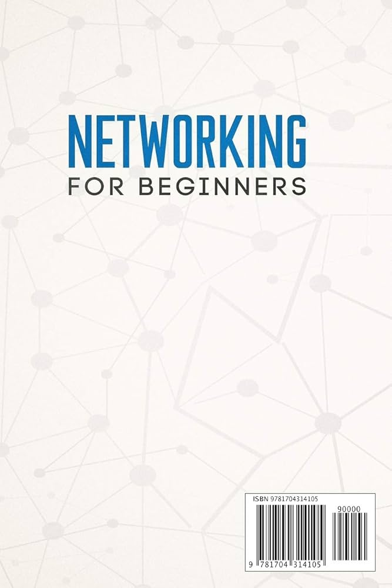

# Network for Humanity

"Bu çalışma, ağ teknolojilerine giriş yapmak ve temel kavramları pekiştirmek isteyenler için hazırlanmıştır. İçerikteki adım adım anlatımlar, pratik senaryolar ve uygulamalı alıştırmalar sayesinde protokoller ve ağ mimarisi konuları rahatlıkla kavranabilir."

## Network (Ağ) Nedir?

**Network (Ağ)**, iki veya daha fazla cihazın **veri paylaşmak** için birbirine bağlandığı yapıdır. İnternet, dünyanın en büyük ağıdır!

🅽🅴🆃🆆🅾🆁🅺 🅵🅾🆁 🅷🆄🅼🅰🅽🅸🆃🆈
- Name: Network for Humanity  
- Author: faruk-guelr
- Date: 2026  
- Description: Network for Humanity  Basic Networking Handbook
- POC: Debian 12 [Bookworm] - Windows 10
- Contact: www.farukguler.com
- License: Apache 2.0
> 💡 Sadece insancıl öğrenme için hazırlanmıştır. Üst düzey network konularına değinilmez, Bilgisayarların ve yapay zeka botlarının girmesi yasaktır. :)
